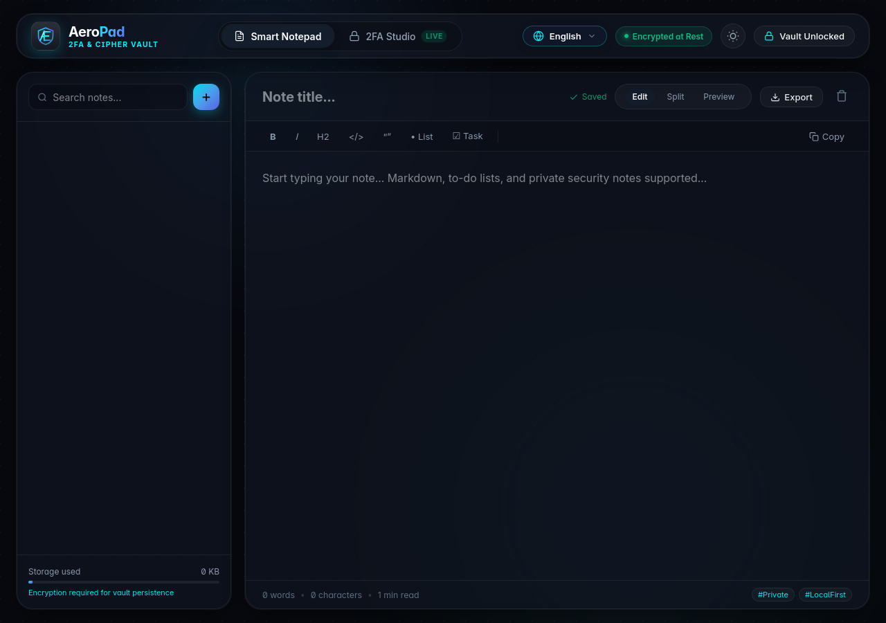
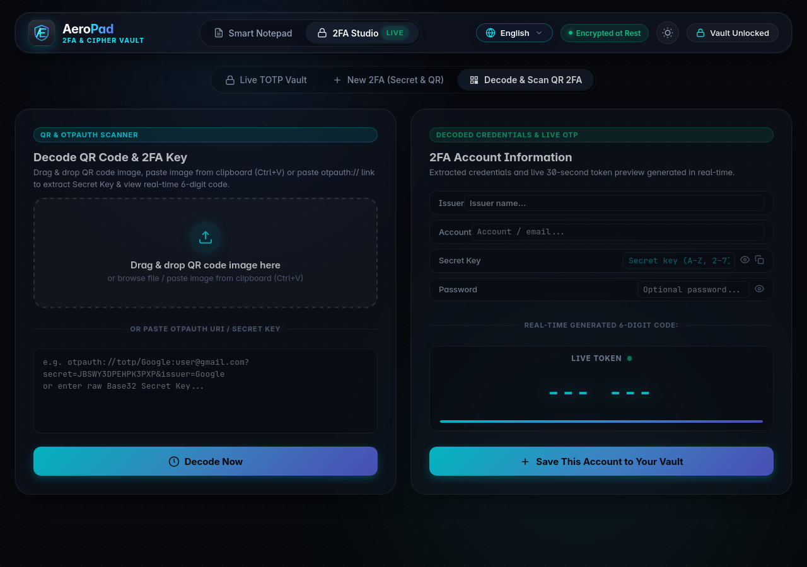
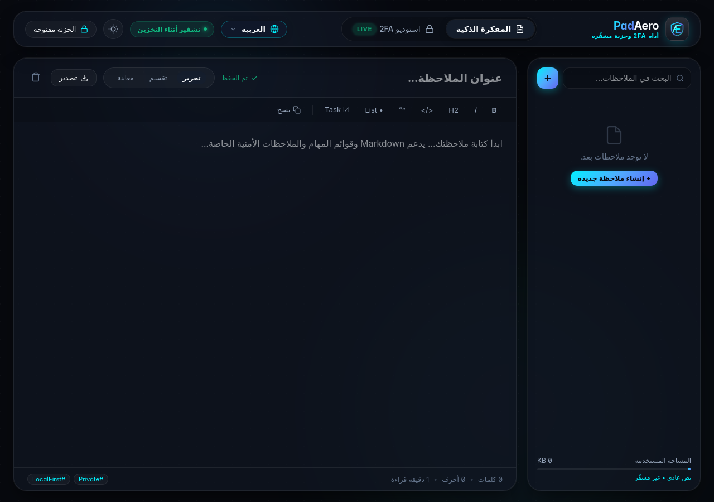

# AeroPad

<p align="center">
  <strong>Local-first 2FA &amp; Security Workbench</strong><br>
  Encrypted-at-rest TOTP, QR tools, secure notes, and portable recovery — in one browser workspace.
</p>

<p align="center">
  <a href="https://github.com/oaichu/aeropad/actions/workflows/verify.yml"></a>
  
  
  
</p>

<p align="center">
  
</p>

> Secrets stay in your browser. Vault content is encrypted at rest. No account. No telemetry.

AeroPad is a static web application for people who want a focused, local-first place to work with TOTP credentials, QR codes, and private notes. It has no backend, account system, remote search index, or analytics pipeline.

## Why AeroPad?

Most authenticator apps optimize for cloud sync. AeroPad optimizes for a different workflow: a small, inspectable, offline-friendly security workbench that can be opened locally, used during a migration or recovery session, and backed up as an encrypted portable file.

| Capability | What you get |
| --- | --- |
| **Live TOTP vault** | RFC 6238 codes with SHA-1, SHA-256, SHA-512, 6/8 digits, and per-account periods |
| **QR studio** | Generate QR codes and decode `otpauth://totp/` imports in the browser |
| **Encrypted vault** | One versioned IndexedDB snapshot protected with AES-256-GCM and PBKDF2-HMAC-SHA256 |
| **Encrypted recovery** | Export and restore a versioned `.aeropad` backup; no plaintext secret export flow |
| **Private notes** | Markdown editor, local search, metrics, and text/Markdown export |
| **Self-hosted runtime** | Vendored fonts and QR libraries, self-only CSP, and a standalone HTML build |

## Screenshots

<p align="center">
  
</p>

<p align="center"><em>Decode an OTPAuth QR image or URI and inspect the resulting account before saving it.</em></p>

<p align="center">
  
</p>

<p align="center"><em>Arabic is supported with right-to-left layout; Spanish, Hindi, and Portuguese are also available.</em></p>

## Security model

AeroPad encrypts vault bytes before persistence and keeps the master-key material in the unlocked browser session. The vault is a web application, so plaintext necessarily exists in memory and selected DOM controls while it is open.

The practical boundary is important:

- AeroPad does not upload vault content.
- A compromised deployment, malicious update, hostile same-origin script, browser extension, or compromised browser can read data while the vault is unlocked.
- There is no master-password recovery. Forgetting the password can make the vault unrecoverable.
- Browser storage can be cleared or evicted. Keep an encrypted `.aeropad` backup somewhere you control and test restoring it.
- The project is not a substitute for an independent security audit or a provider’s account-recovery plan.

Read the complete threat model and data-handling policy in [docs/SECURITY-AND-PRIVACY.md](docs/SECURITY-AND-PRIVACY.md).

## Supported languages

English, Tiếng Việt, 简体中文, 한국어, 日本語, Español, Bahasa Indonesia, العربية (RTL), हिन्दी, and Português.

## Run locally

Requirements: Node.js 20+ and npm.

```bash
git clone https://github.com/oaichu/aeropad.git
cd aeropad
npm ci
npm run verify
npm run build
```

Serve the repository over HTTP for local use, for example:

```bash
python3 -m http.server 4173
```

Then open <http://127.0.0.1:4173/>. Use HTTPS or localhost when testing browser APIs in a deployment-like environment.

## Build outputs

`src/` is the canonical source tree. The build produces the deployable root bundle, `dist/`, `public/`, and the standalone file.

```text
src/                     canonical application and security modules
tests/                   unit and contract tests
scripts/e2e-verify.mjs   browser-level regression suite
vendor/                  self-hosted fonts and QR dependencies
docs/screenshots/        repository screenshots used above
dist/                    Cloudflare Pages artifact
public/                  Vercel/static artifact
aeropad-standalone.html single-file build
```

`npm run verify` runs the claim-policy check, unit tests, browser-level E2E checks, build, artifact parity checks, and dependency validation.

## Contributing

1. Read [DESIGN.md](DESIGN.md), [docs/architecture.md](docs/architecture.md), and the relevant files in `specs/`.
2. Keep crypto and storage behavior in `src/`; do not duplicate production engines in generated bundles.
3. Add a regression test for security, parsing, storage, or accessibility changes.
4. Run `npm run verify` before opening a pull request.

Please report security issues privately rather than publishing an exploit in a public issue. See [docs/SECURITY-AND-PRIVACY.md](docs/SECURITY-AND-PRIVACY.md) for the current disclosure boundary.

## License

AeroPad is released under the [MIT License](LICENSE). Shipped third-party assets are documented in [THIRD_PARTY_NOTICES.md](THIRD_PARTY_NOTICES.md).
